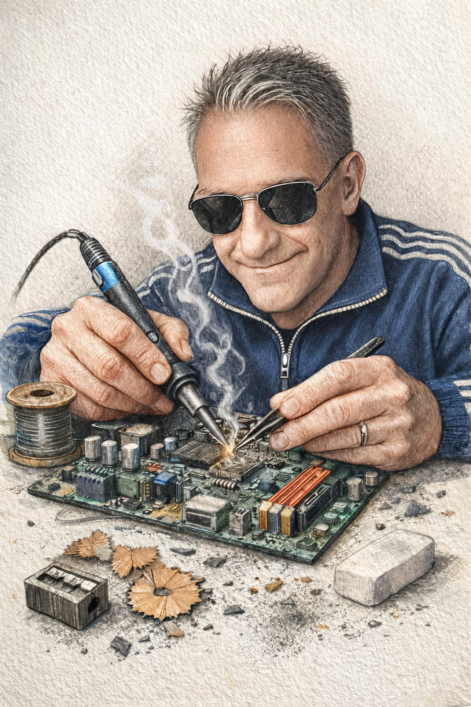

# Chi Sono

  

    
  

  

    <h2>In Breve</h2>
    
Sono un professionista pratico con un profilo atipico: non ho un titolo in ingegneria, ma svolgo con passione e competenza il ruolo di Automation Engineer, specializzandomi nell'integrazione tra hardware, software e meccanica. La mia forza è trasformare idee in prototipi funzionali, partendo da componenti elettronici, microcontrollori e sensori, fino alla realizzazione di sistemi completi e automatizzati.

    
Nel corso degli anni ho realizzato:

    <ul>
      <li>🖨️ Una stampante 3D di grandi dimensioni</li>
      <li>⚙️ Una fresa CNC a 5 assi</li>
      <li>🏗️ Una fresa CNC a 3 assi di grandi dimensioni</li>
      <li>📐 Un plotter verticale</li>
      <li>⚡ Circa <strong>50 progetti</strong> nel campo dell'automazione</li>
    </ul>
  

---

## Il Mio Percorso

La mia storia inizia dalla curiosità: **come funzionano le cose?** Questa domanda mi ha portato a smontare, studiare e ricostruire dispositivi sempre più complessi, fino a progettarne di nuovi da zero.

### Competenze Chiave

**Elettronica Digitale** ⭐⭐⭐⭐⭐
- Conoscenza approfondita di circuiti digitali e analogici
- Design PCB e schemi elettrici
- Debug e troubleshooting hardware
- Integrazione sensori e attuatori

**Microcontrollori** ⭐⭐⭐⭐⭐
- Ottima conoscenza di Arduino, ESP32, STM32
- Firmware custom in C/C++
- Comunicazione seriale: UART, I2C, SPI
- Integrazione con Raspberry Pi

**Sviluppo Software** ⭐⭐⭐⭐
- **C++** per firmware embedded ad alte prestazioni
- **Python** per automazione, script e data processing
- **Laravel** (PHP) per software gestionali completi
- JavaScript/HTML/CSS per interfacce web

**Meccanica e CAD** ⭐⭐⭐⭐
- Disegno tecnico con FreeCAD e AutoCAD
- Progettazione parti custom
- Assemblaggio meccanica di precisione
- Conoscenza sistemi di trasmissione (cinghie, viti, guide)

---

## Progetti Significativi

### 🖨️ Stampante 3D Custom (900×740×800mm)

Il mio progetto più ambizioso: una stampante 3D **4 volte più grande** di quelle consumer, completamente progettata e realizzata da zero.

**Sfide affrontate:**
- Design strutturale per minimizzare vibrazioni
- Elettronica custom con BIGTREETECH Octopus Pro
- Configurazione avanzata firmware Klipper
- Sistema di riscaldamento piatto per grandi dimensioni

**Risultato:** Macchina funzionante e affidabile al costo di 1/5 di una soluzione commerciale.

[Vedi il progetto completo →](stampante-3d/)

---

### ⚙️ CNC a 5 Assi

Una fresa CNC che evolve da 3 assi a 5 assi completi, capace di lavorazioni complesse su legno, plastica e metalli teneri.

**Cosa ho imparato:**
- Progettazione strutture rigide e precise
- Controllo numerico e G-code
- Elettronica di potenza per motori
- Software di controllo (GRBL, LinuxCNC)

[Vedi il progetto →](CNC/)

---

### 📐 Plotter Verticale

Un esperimento di arte generativa: un robot che disegna su pareti usando solo due motori e cavi.

**Aspetti interessanti:**
- Cinematica inversa per calcolo movimento
- Generazione artistica da immagini
- Controllo precisione su grandi distanze

[Vedi il progetto →](plotter-verticale/)

---

## Filosofia di Lavoro

### 🎯 Pragmatismo
**Soluzioni che funzionano.** Non mi fermo alla teoria: ogni progetto deve superare la prova del mondo reale. Prototipo, testo, itero, miglioro.

### 🔧 Approccio Integrato
Hardware, software e meccanica **non sono mondi separati**. I migliori progetti nascono quando queste discipline collaborano fin dall'inizio.

### 📚 Apprendimento Continuo
Ogni progetto è un'opportunità per imparare qualcosa di nuovo. Tecnologie, linguaggi, approcci: la curiosità è il motore dell'innovazione.

### 💡 Problem Solving
I progetti reali presentano sempre sfide inaspettate. La capacità di **analizzare, debuggare e trovare soluzioni creative** è ciò che distingue un prototipo funzionante da uno fallito.

---

## Cosa Posso Fare Per Te

### 🏭 Automazione Industriale
Progetto e realizzo sistemi di automazione per piccole produzioni, retrofit di macchinari esistenti, controlli industriali custom.

### 🔬 Prototipazione Rapida
Hai un'idea? Ti aiuto a trasformarla in un prototipo funzionante: elettronica, firmware, meccanica e software.

### ⚙️ Macchine CNC e Stampanti 3D
Consulenza per costruzione, ottimizzazione o upgrade di macchine CNC e stampanti 3D. Dalla selezione componenti al tuning finale.

### 💻 Sviluppo Software
- **Firmware embedded:** C/C++ per microcontrollori
- **Software gestionali:** Laravel per applicazioni web complete
- **Interfacce IoT:** Dashboard web per controllo dispositivi
- **Automazione:** Script Python per task ripetitivi

### 📚 Formazione e Mentoring
Workshop, corsi e affiancamento su elettronica, microcontrollori, automazione e sviluppo embedded.

---

## Perché Questo Portfolio?

Ho deciso di creare questo portfolio per **mettere a reddito le mie competenze** e condividere la mia esperienza con altri maker, aziende e appassionati.

Non ho un grande rapporto con i social media tradizionali, ma credo fermamente nel valore della **documentazione tecnica** e della **condivisione di conoscenza**. Questo blog è il mio modo di comunicare: attraverso progetti concreti, codice funzionante e soluzioni reali.

Se anche tu credi che la tecnologia debba essere **accessibile, documentata e condivisa**, siamo sulla stessa lunghezza d'onda.

---

## Interessi e Curiosità

Oltre ai progetti tecnici, sono appassionato di:
- 🤖 **Robotica e AI:** Come i sistemi automatici possono migliorare la vita
- 🎮 **Gaming:** Meccaniche di gioco e game design
- 📖 **Lettura tecnica:** Manuali, datasheet, paper scientifici
- 🌱 **DIY e autoproduzione:** Costruire invece di comprare quando possibile
- ☕ **Caffè:** Tanto caffè (necessario per debug notturni)

---

## Statistiche Nerd

**Progetti completati:** 50+

**Ore di debug:** ∞ Infinite!

**Microcontrollori bruciati:** 5 (RIP)

**Caffè consumati:** 9999+

**Soddisfazione:** ████████████ 100%

---

## Valori

- 🔓 **Open Knowledge:** La conoscenza è più utile quando condivisa
- ⚡ **Fatto è meglio di perfetto:** L'importante è che funzioni
- 🛠️ **Right tool for the job:** Ogni problema ha la soluzione giusta
- 🔁 **Iterazione continua:** Nessun progetto è mai "finito", si può sempre migliorare
- 🤝 **Collaborazione:** Le migliori idee nascono dal confronto

---

## Contatti

Sono sempre aperto a nuove collaborazioni, progetti interessanti e scambi di idee.

📧 **Email:** peppe.minniti@gmail.com

💼 **LinkedIn:** linkedin.com/in/giuseppe-minniti-m2m-fablab

🐙 **GitHub:** github.com/peppe.minniti/blog

📷 **Instagram:** @appena pronti ....

**Rispondo solitamente entro 24-48 ore.**

---

## Status Attuale

🟢 **Disponibile per nuovi progetti**

Attualmente sto lavorando su:
- Ottimizzazione stampante 3D (Input Shaper avanzato)
- Modifica stampante 3D da monocolore a 4 colori con nuova testina Anycubic
- Upgrade CNC 5 assi con nuovi motori servo
- Nuovo progetto segreto (automazione domestica)

---

## Let's Build Something Amazing

Se hai un'idea, un problema da risolvere o semplicemente vuoi fare due chiacchiere su elettronica e automazione, **non esitare a contattarmi**.

I migliori progetti nascono dalle conversazioni più inaspettate.

---

[Torna al Portfolio](README.md) - [Vedi i Progetti](README.md#-progetti-in-evidenza)

---

*"La differenza tra teoria e pratica, in pratica, è maggiore che in teoria"*
*— Anonimo (probabilmente un ingegnere stanco)*
