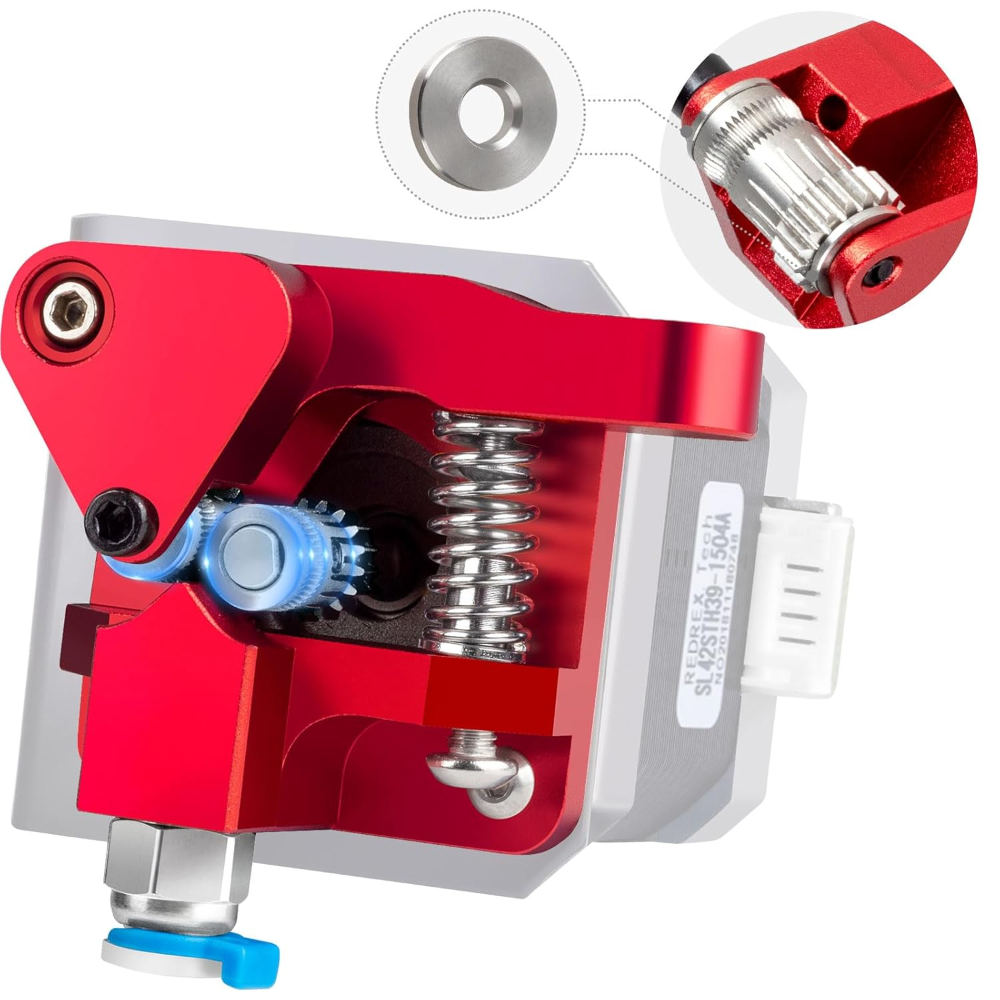
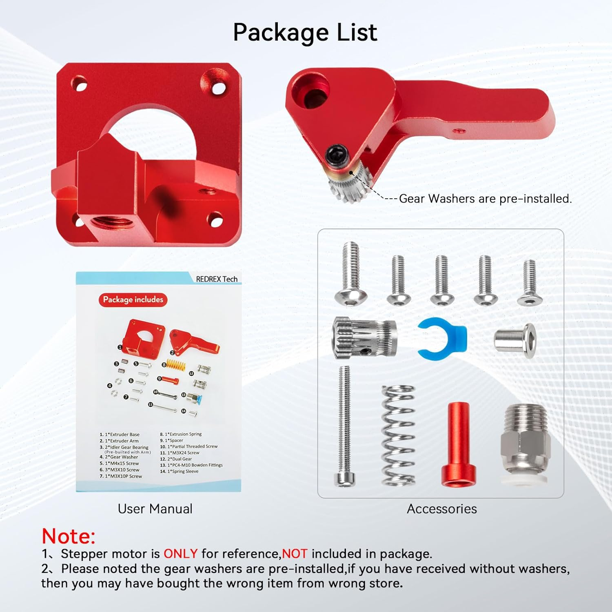

# Montaggio Estrusore e Hotend

## Descrizione

Installazione del sistema di estrusione: estrusore (gear box che spinge il filamento) e hotend (parte che fonde il materiale). Il cuore della stampante 3D.

Componenti:
- Estrusore: BMG clone dual gear
- Hotend: All-metal tipo E3D V6
- Ugello: 0.4mm (sostituibile)
- Termistor: ATC Semitec 104GT-2

## Immagini

<div class="thumbnail-gallery">
  
  
  
</div>

## Estrusore BMG (Bowden o Direct)

### Caratteristiche

```yaml
Tipo: Dual gear (doppio ingranaggio)
Filamento: 1.75mm
Grip: Ingranaggi dentati
Vantaggio: Precisione, no slipping
```

### Montaggio Estrusore

```bash
1. Assemblare corpo estrusore (viti M3)
2. Inserire cuscinetti ingranaggi
3. Montare leva tensionatore
4. Installare motore NEMA 17
5. Regolare tensione molla
```

### Regolazione Tensione

```python
# Tensione ideale
compressione_molla = 1.5  # mm (circa 1-2 giri vite)

# Verifica tensione
# - Troppo forte: segni profondi su filamento
# - Troppo debole: slipping durante retraction
# - Corretta: leggero grip, no slipping
```

## Hotend All-Metal

### Componenti Hotend

```yaml
Heatbreak: Tubo acciaio con PTFE interno
Heater block: Blocco alluminio
Resistenza: 24V 40W (cartridge heater)
Termistor: ATC Semitec 104GT-2 (100K)
Ugello: Acciaio temperato 0.4mm M6 thread
Heat sink: Alette raffreddamento + ventola
```

### Assemblaggio Hotend

**⚠️ IMPORTANTE:** Assemblare a caldo (220-240°C)

```bash
# Procedura hot-tightening
1. Avvitare ugello a mano nel heater block
2. Inserire heatbreak (senza serrare)
3. Riscaldare a 240°C
4. Serrare ugello (lasciare 0.5mm gap)
5. Serrare heatbreak contro ugello
6. Raffreddare
```

### Installazione Termistor

```yaml
Tipo: Glass bead thermistor
Posizione: Foro laterale heater block
Fissaggio: Vite M3 grub screw
IMPORTANTE: Non serrare troppo (fragile)
```

### Installazione Resistenza

```yaml
Cartridge heater: 24V 40W
Dimensione: 6mm × 20mm
Fissaggio: Vite M3 grub screw
Coppia serraggio: Moderata (2Nm)
```

## Sistema Raffreddamento

### Hotend Cooling (Sempre ON)

```yaml
Ventola: 24V 40×40mm
Flusso aria: Su heat sink
Scopo: Evitare risalita calore
Controllo: Sempre accesa (100%)
```

### Part Cooling (PWM Controllato)

```yaml
Ventola: 24V 50×50mm blower
Posizione: Direzionata su pezzo
Flusso: 0-100% PWM
Scopo: Raffreddamento layer stampato
```

## Configurazione Klipper Estrusore

```ini
[extruder]
step_pin: PD15
dir_pin: PD14
enable_pin: !PC7
microsteps: 8
rotation_distance: 7.82  # BMG dual gear (ATTENZIONE ***** da calibrare! ***** )
nozzle_diameter: 0.400
filament_diameter: 1.750

# Termistor
sensor_type: ATC Semitec 104GT-2
sensor_pin: PF4
pullup_resistor: 4700

# Limiti temperatura
min_temp: 0
max_temp: 300
min_extrude_temp: 170

# Pressure advance (calibrare)
pressure_advance: 0.055
pressure_advance_smooth_time: 0.040

# PID tuning (eseguire calibrazione)
control: pid
pid_Kp: 22.2
pid_Ki: 1.08
pid_Kd: 114
```

## Calibrazione E-Steps

### Procedura Calibrazione

```python
# 1. Marcare filamento a 120mm da estrusore
# 2. Estrudere 100mm via console
# 3. Misurare quanto filamento è rimasto

lunghezza_iniziale = 120  # mm
lunghezza_finale = 30     # mm (misurato)
estruso_comandato = 100   # mm

estruso_reale = lunghezza_iniziale - lunghezza_finale  # 90mm

rotation_distance_attuale = 7.82  # valore attuale
rotation_distance_nuovo = rotation_distance_attuale * (estruso_comandato / estruso_reale)

print(f"Nuovo rotation_distance: {rotation_distance_nuovo:.2f}")
# Aggiornare in printer.cfg
```

## Problemi Comuni

| Problema | Causa Probabile | Soluzione |
|----------|-----------------|-----------|
| Under-extrusion | Rotation distance errato | Calibrare E-steps |
| Filamento bloccato | Gap ugello-heatbreak | Riassemblare a caldo |
| Temperature instabile | Termistor allentato | Verificare fissaggio |
| Oozing eccessivo | Pressure advance basso | Aumentare valore |
| Clogging | Residui nel nozzle | Pulizia cold pull |

## Test Funzionamento

```gcode
; Test estrusione base
M104 S200        ; Riscalda hotend a 200°C
M109 S200        ; Attendi temperatura
G92 E0           ; Reset posizione estrusore
G1 E50 F300      ; Estrudi 50mm a 5mm/s
G92 E0           ; Reset
G1 E-5 F1800     ; Retract 5mm
M104 S0          ; Spegni hotend
```

## Checklist

- [ ] Estrusore assemblato e tensione regolata
- [ ] Hotend assemblato a caldo correttamente
- [ ] Termistor fissato senza serraggio eccessivo
- [ ] Resistenza installata con coppia corretta
- [ ] Ventole funzionanti (hotend sempre ON)
- [ ] Cablaggio ordinato e fissato
- [ ] E-steps calibrati
- [ ] Test estrusione positivo
- [ ] Nessuna perdita filamento fuso

---

[Torna alle Fasi di Realizzazione](../README.md) - [Torna al Progetto](../../index.md)
