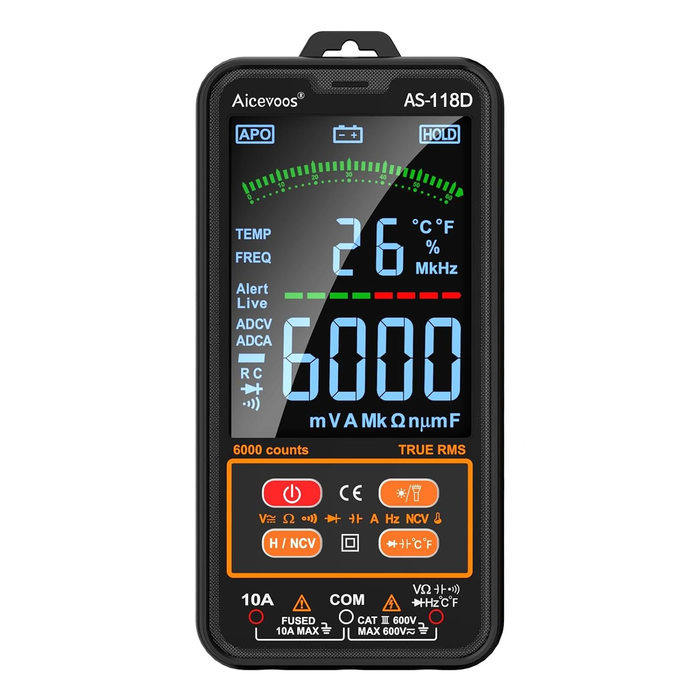
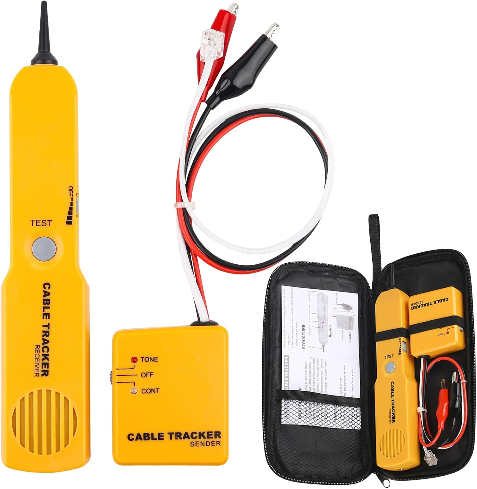
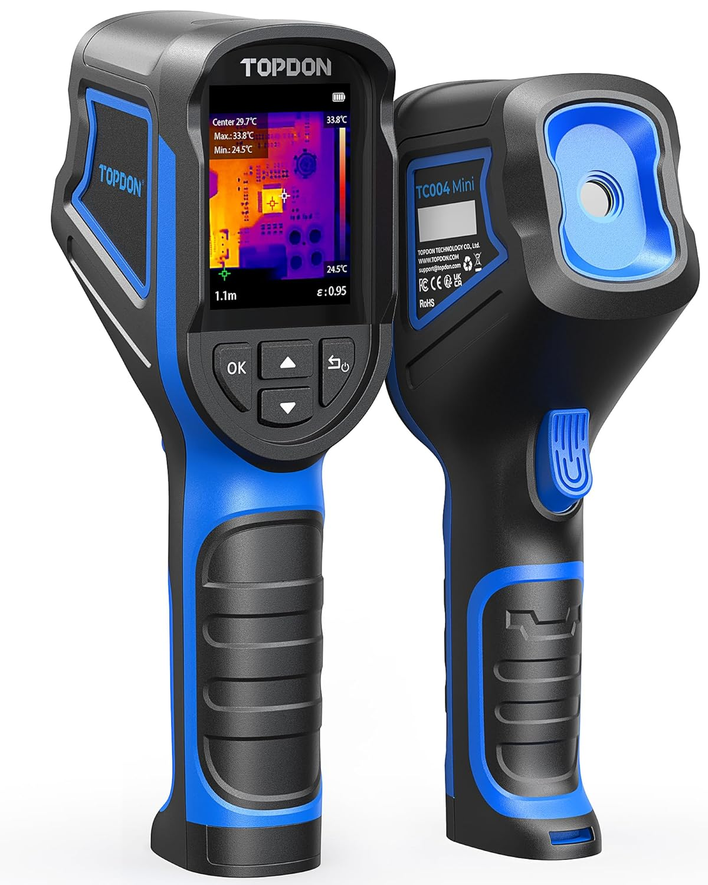

# Test Continuità e Verifica Cablaggio

## Descrizione

Test fondamentali da eseguire PRIMA della prima accensione per evitare danni ai componenti. Questa fase previene cortocircuiti, inversioni di polarità e cablaggio errato.

**⚠️ IMPORTANTE:** NON saltare questi test! Un errore di cablaggio può danneggiare irreparabilmente scheda e componenti.

## Immagini

<div class="thumbnail-gallery">
  
  
  
</div>

## Strumenti Necessari

```yaml
Essenziali:
  - Multimetro digitale (modalità: Ω, V, continuità)
  - Pinze a becco lungo

Opzionali:
  - Tester cavi (cable tester)
  - Termocamera (verifica surriscaldamenti)
  - Alimentatore variabile (test graduale)
```

## Test Pre-Alimentazione

### 1. Test Isolamento Alimentazioni

```yaml
Test da eseguire (PSU scollegati da carico):

PSU 24V 10A:
  - V+ verso GND: > 1MΩ
  - V+ verso PE (terra): > 1MΩ
  - GND verso PE: < 1Ω (se chassis collegato)

PSU 36V 30A:
  - V+ verso GND: > 1MΩ
  - V+ verso PE: > 1MΩ

PSU 24V 62.5A:
  - V+ verso GND: > 1MΩ
  - V+ verso PE: > 1MΩ
```

### 2. Test Cortocircuiti Scheda

```bash
# Test con PSU SCOLLEGATO
# Octopus Pro

Multimetro in modalità continuità:

V+ main input → GND:
  Resistenza attesa: > 100kΩ
  (Se < 10kΩ: possibile corto!)

Heater output (HE0) → GND:
  Resistenza: 10-30Ω (resistenza heater cartridge)
  (Se 0Ω: corto! Se infinito: heater disconnesso)
```

### 3. Verifica Polarità Connessioni

```yaml
Connessioni critiche da verificare:

Motori stepper:
  - Sequenza bobine: 2B 2A 1A 1B
  - Verifica: Misurare resistenza coppie
    - Pin 1-2: ~2-4Ω (bobina A NEMA17)
    - Pin 3-4: ~2-4Ω (bobina B NEMA17)
    - Pin 1-3: infinito (no connessione tra bobine)

Termistors:
  - Resistenza a 25°C: ~100kΩ
  - (Se 0Ω: corto, Se infinito: disconnesso)

Endstop:
  - NO (normally open): infinito quando non premuto
  - NC (normally closed): 0Ω quando non premuto
```

## Test Sensori

### Thermistors

```yaml
Test temperatura ambiente (25°C):

Hotend thermistor:
  - Resistenza misurata: 95-105kΩ
  - Tolleranza: ±5%
  - Se fuori range: termistor difettoso

Test riscaldamento:
  - Scaldare termistor con dita
  - Resistenza deve diminuire (es. 100kΩ → 80kΩ)
```

### Endstop Meccanici

```yaml
Test continuità (NO type):

Non premuto:
  - Resistenza: infinito (circuito aperto)

Premuto:
  - Resistenza: < 1Ω (cortocircuito)

Se comportamento invertito: tipo NC (normally closed)
```

### BLTouch

```yaml
Test alimentazione (con PSU acceso):
  - Pin rosso-marrone: 5V ±0.25V
  - Consumo: ~100mA

Test sonda:
  - Pin bianco-nero: Alta impedenza (10kΩ+)
  - Quando sonda estesa e triggera: 0V
  - Quando ritratta: 5V

Movimento pin:
  - All'accensione: extend/retract 2 volte (self-test)
  - LED rosso lampeggiante: OK
  - LED rosso fisso: ERRORE
```
_I colori possono essere diversi in base ai modelli (potresti trovarti anche il blu e il viola)_


## Test Driver Stepper

### TMC2209 (su Octopus)

```yaml
Test pre-installazione:
  - Verificare jumper UART rimosso
  - Settare jumper microstep
  - Orientamento: Heatsink verso alto
```

### DM556 (esterni)

```yaml
Configurazione DIP switch:
  - Microstep Y: 64 → SW 5,6,7 = ON-ON-OFF
  - Microstep Z: 32 → SW 5,6,7 = ON-OFF-OFF
  - Corrente: Impostare secondo NEMA23 (da 2A a 4.2A) 

Test LED:
  - LED verde: Power OK
  - LED rosso: Errore (sovracorrente, sovratemperatura)
```

## Test Prima Accensione

### Sequenza Sicura

```bash
# Step 1: Alimentare solo logica (24V 10A)
1. Collegare PSU 24V → Octopus Pro
2. NON collegare motori
3. Accendere PSU
4. Verificare:
   - LED Octopus acceso
   - Temperatura MCU < 40°C
   - USB riconosciuto da Raspberry Pi

# Step 2: Connettere termistors
1. Collegare hotend thermistor
2. Verificare lettura temperatura Klipper:
   - Deve mostrare ~25°C (ambiente)
   - Se -273°C: corto
   - Se 999°C: disconnesso

# Step 3: Test motori (uno alla volta) 
# ATTENZIONE ######## COLLEGARE SEMPRE A SISTEMA SPENTO ########
1. Collegare motore X
2. Disabilitare tutti gli altri stepper nel config
3. Testare movimento: G1 X10 F1000
4. Verificare:
   - Movimento fluido
   - Direzione corretta
   - Nessun surriscaldamento driver
5. Ripetere per Y, Z, E
```

## Test Heater (Attenzione!)

```yaml
Test hotend heater:
  1. Verificare resistenza cartridge: 10-30Ω
  2. Impostare target: 50°C (basso per test)
  3. Monitorare temperatura ogni 5 secondi
  4. Verificare:
     - Temperatura sale gradualmente
     - Nessun odore bruciato
     - Thermal runaway non triggera
  5. Raggiunto target: temperatura stabile
  6. Spegnere e verificare raffreddamento

⚠️ NON lasciare incustodito durante test!
```

## Problemi Comuni e Diagnosi

| Sintomo | Causa Probabile | Test |
|---------|-----------------|------|
| LED Octopus spento | No alimentazione | Misurare 24V su morsettiera |
| Motore non gira | Bobine invertite | Verificare sequenza pin |
| Driver brucia | Vref troppo alto | Controllare corrente config |
| Temp 999°C | Termistor scollegato | Test continuità cavo |
| Temp -273°C | Termistor in corto | Misurare resistenza |
| Endstop sempre triggered | Pullup errato o cavo | Invertire logica o verificare cavo |
| BLTouch LED rosso fisso | Errore meccanico | Verificare pin non bloccato |
| PSU si spegne subito | Corto su carico | Scollegare carichi e testare |

## Log Test Consigliato

```markdown
# Log Test Continuità Stampante 3D

## Pre-accensione
- [ ] Isolamento PSU > 1MΩ
- [ ] No corti V+ → GND
- [ ] Polarità corretta

## Motori
- [ ] NEMA17 X: Bobine ___Ω / ___Ω
- [ ] NEMA17 E: Bobine ___Ω / ___Ω
- [ ] NEMA23 Y: Bobine ___Ω / ___Ω M1
- [ ] NEMA23 Y: Bobine ___Ω / ___Ω M2
- [ ] NEMA23 Z: Bobine ___Ω / ___Ω M1
- [ ] NEMA23 Z: Bobine ___Ω / ___Ω M2
- [ ] NEMA23 Z: Bobine ___Ω / ___Ω M3
- [ ] NEMA23 Z: Bobine ___Ω / ___Ω M4

## Sensori
- [ ] Hotend thermistor: ___kΩ @ 25°C
- [ ] Endstop X: NO test OK
- [ ] Endstop Y: NO test OK
- [ ] BLTouch: Self-test OK

## Prima accensione
- [ ] Octopus LED ON
- [ ] Klipper connesso
- [ ] Temperature leggibili
- [ ] Motori movimento OK
- [ ] Heater test 50°C OK

Firma: ________________
```

## Checklist Finale

- [ ] Tutti i test isolamento passati (>1MΩ)
- [ ] Nessun cortocircuito rilevato
- [ ] Bobine motori verificate (2-4Ω)
- [ ] Termistors leggono ~100kΩ @ 25°C
- [ ] Endstop rispondono correttamente
- [ ] BLTouch self-test OK
- [ ] Prima accensione senza fumi/odori
- [ ] Klipper si connette e legge sensori
- [ ] Motori si muovono nelle direzioni corrette
- [ ] Log test compilato e conservato

---

[Torna alle Fasi di Realizzazione](../README.md) - [Torna al Progetto](../../index.md)
