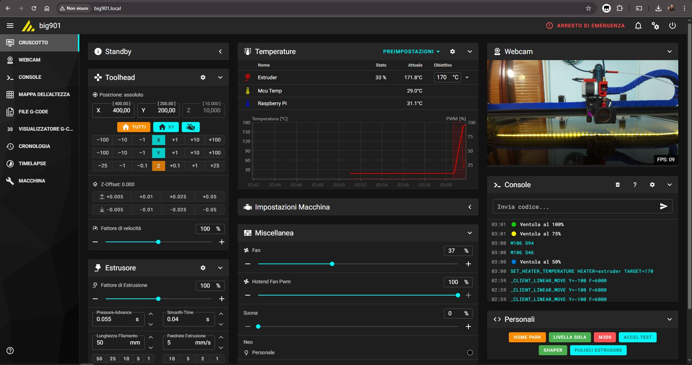

# Setup Mainsail UI

## Descrizione

Configurazione dell'interfaccia web Mainsail per il controllo completo della stampante. Mainsail è un frontend moderno e intuitivo per Klipper.

Caratteristiche:
- Dashboard in tempo reale
- Controllo temperature e assi
- Gestione GCode
- Webcam integration
- Grafici storici
- Update manager integrato

## Immagini

<div class="thumbnail-gallery">
  
</div>

## Accesso Interfaccia

### URL Mainsail

```yaml
Indirizzo di rete:
  - http://mainsailos.local
  - O http://[IP_RASPBERRY_PI]

Default MainsailOS:
  - Mainsail già preinstallato
  - Moonraker (API server) già configurato
  - Porta: 80 (HTTP standard)

Accesso remoto (opzionale):
  - Port forwarding router: 80 → RPi
  - Domain con DNS dinamico
  - VPN (più sicuro)
```

## Layout Dashboard

### Schermata Principale

```yaml
Sezioni dashboard:

1. Status Card (in alto):
   - Stato stampante: Ready / Printing / Error
   - MCU status e temperature
   - Velocità e avanzamento stampa

2. Temperatura Card:
   - Grafici real-time hotend e bed
   - Controlli temperatura target
   - Storico temperature

3. Controllo Assi:
   - Jog controls (X, Y, Z)
   - Homing buttons
   - Posizioni attuali

4. Estrusore:
   - Carica/scarica filamento
   - Estrusione manuale
   - Retraction

5. File Manager:
   - Upload GCode
   - Organizzazione cartelle
   - Preview modelli

6. Console GCode:
   - Invio comandi manuali
   - Log output
   - Autocomplete
```

## Configurazione Iniziale

### 1. Wizard Primo Avvio

```yaml
Al primo accesso:
  1. Welcome screen
  2. Seleziona lingua: Italiano/English
  3. Theme: Dark/Light (consigliato Dark)
  4. Layout dashboard: Standard
  5. Unità misura: Metrico
```

### 2. Configurazione Webcam (Opzionale)

```yaml
# Se webcam USB collegata

Settings → Webcam:
  Name: Main Camera
  URL Stream: /webcam/?action=stream
  URL Snapshot: /webcam/?action=snapshot
  Rotate: 0° (o 90/180/270 se necessario)
  Flip H/V: No

Test:
  - Dashboard → Webcam icon
  - Dovrebbe mostrare stream live
```

### 3. Heightmap Visualization

```yaml
# Visualizzazione bed mesh

Settings → Heightmap:
  - Enable 3D visualization: ✓
  - Colormap: Viridis / Plasma
  - Extrude mesh: 5× (amplifica errori per visibilità)

Utilizzo:
  - Dopo bed mesh calibration
  - Dashboard → Heightmap tab
  - Visualizza deformazioni piatto
```

## Personalizzazione Dashboard

### 4. Layout Dashboard

```yaml
Dashboard → Settings (icona ingranaggio):

Card visibili:
  ✓ Temperature
  ✓ Status
  ✓ Toolhead Control
  ✓ Extruder
  ✓ Files
  ✓ Console
  ✓ Heightmap (dopo calibrazione)

Card opzionali:
  □ History (storico stampe)
  □ Webcam (se configurata)
  □ Timelapse
```

### 5. Grafici Temperatura
##### _Tutti i riferimenti a Bed e Hotbed sono da considerarsi ininfluenti nel caso di controller esterno del piatto_

```yaml
Temperature Chart → Settings:

Update interval: 1s (real-time)
Data retention: 1h (conserva grafici)

Serie visibili:
  ✓ Hotend actual
  ✓ Hotend target
  ✓ Bed actual
  ✓ Bed target
  ✓ Chamber (se presente)
  ✓ MCU temp
  ✓ RPi temp

Colors: Auto (personalizzabile)
```

## File Manager e GCode

### Upload GCode

```yaml
Metodo 1: Drag & Drop
  - Trascinare .gcode nella sezione Files
  - Upload automatico

Metodo 2: Upload Button
  - Files → Upload icon
  - Selezionare file da PC

Metodo 3: Via rete (Samba/SFTP)
  - Connessione diretta a ~/printer_data/gcodes/
  - Utile per slicer integration
```

### Organizzazione File

```yaml
Struttura consigliata:

gcodes/
├── PLA/
│   ├── modello1.gcode
│   └── modello2.gcode
├── PETG/
├── Test/
│   ├── calibration_cube.gcode
│   └── temperature_tower.gcode
└── Progetti/
```

### Metadata Gcode

```yaml
Mainsail legge metadata da slicer:

Informazioni estratte:
  - Thumbnail preview (immagine anteprima)
  - Tempo stimato
  - Lunghezza filamento
  - Peso modello
  - Materiale
  - Temperatura hotend/bed

Slicer supportati:
  - PrusaSlicer/SuperSlicer: Ottimo
  - Cura: Buono (con plugin)
  - Simplify3D: Limitato
```

## Macro e Controlli Custom

### 6. Macro Buttons

```yaml
Dashboard → Macros:

Macro utili da aggiungere in printer.cfg:
  - START_PRINT (homing + bed mesh)
  - END_PRINT (park + spegnimento)
  - LOAD_FILAMENT
  - UNLOAD_FILAMENT
  - PID_CALIBRATE_HOTEND
  - PID_CALIBRATE_BED
  - Z_OFFSET_CALIBRATE

Personalizzare pulsanti:
  - Nome visualizzato
  - Descrizione
  - Icona (emoji o Material Design Icons)
```

### Esempio Macro Load Filament

```ini
# In printer.cfg

[gcode_macro LOAD_FILAMENT]
description: Carica filamento nell'estrusore
gcode:
    M109 S200              ; Riscalda a 200°C e attendi
    G91                    ; Relative mode
    G1 E50 F300            ; Estrudi 50mm lentamente
    G1 E50 F500            ; Poi altri 50mm più veloce
    G90                    ; Absolute mode
    M104 S0                ; Spegni hotend
```

## Monitoring e Grafici

### 7. Temperature History

```yaml
Dashboard → History:

Visualizzazione:
  - Grafici temperatura sessione corrente
  - Storico ultime stampe
  - Confronto profili temperatura

Export dati:
  - CSV export per analisi
  - Screenshot grafici
```

### 8. Sensor Monitoring

```yaml
Machine → Sensors:

Sensori disponibili:
  - MCU temperature
  - Raspberry Pi CPU temp
  - Raspberry Pi throttling status
  - Voltage (se configurato)

Allarmi:
  - High temperature warning
  - Throttling alert (RPi undervoltage)
```

## Update Manager

### 9. Gestione Aggiornamenti

```yaml
Machine → Update Manager:

Componenti aggiornabili:
  ✓ Klipper (firmware)
  ✓ Moonraker (API server)
  ✓ Mainsail (frontend)
  ✓ System packages (Raspberry Pi OS)

Procedura update:
  1. Check for updates (automatico ogni 24h)
  2. Review changelog
  3. Update singolarmente o "Update All"
  4. Riavvio automatico servizi

Rollback:
  - Possibile tornare a versione precedente
  - Git commits visibili
```

## Console GCode

### 10. Utilizzo Console

```yaml
Dashboard → Console:

Comandi utili:
  FIRMWARE_RESTART        # Riavvia firmware
  GET_POSITION            # Mostra posizione assi
  QUERY_ENDSTOPS          # Status endstop
  QUERY_PROBE             # Status BLTouch
  STATUS                  # Status generale
  TEMPERATURE_WAIT        # Attendi temperatura
  PROBE_CALIBRATE         # Calibra Z offset
  BED_MESH_CALIBRATE      # Avvia bed mesh
  SAVE_CONFIG             # Salva configurazione

Autocomplete:
  - Digitare comando parziale → TAB
  - Lista comandi disponibili

Storico comandi:
  - Freccia SU/GIÙ per navigare
  - Salva ultimi 100 comandi
```

## Configurazione Avanzata

### 11. Moonraker.conf

```ini
# File: ~/printer_data/config/moonraker.conf

[server]
host: 0.0.0.0
port: 7125
klippy_uds_address: /home/pi/printer_data/comms/klippy.sock

[authorization]
trusted_clients:
    192.168.1.0/24  # Rete locale
    ::1/128         # Localhost IPv6
cors_domains:
    http://mainsailos.local
    http://192.168.1.*

[file_manager]
enable_object_processing: True  # Thumbnail extraction

[update_manager]
enable_auto_refresh: True
refresh_interval: 24  # Ore

[update_manager mainsail]
type: web
channel: stable
repo: mainsail-crew/mainsail
path: ~/mainsail
```

### 12. Timelapse (Plugin)

```bash
# Installazione plugin timelapse
cd ~
git clone https://github.com/mainsail-crew/moonraker-timelapse.git
cd moonraker-timelapse
./install.sh

# Config in moonraker.conf
[timelapse]
output_path: ~/printer_data/timelapse/
frame_folder: /tmp/timelapse/
ffmpeg_binary_path: /usr/bin/ffmpeg
```

## Mobile Access

### 13. Accesso da Smartphone

```yaml
Browser mobile:
  - Chrome/Safari: Supportato
  - Interface responsive
  - Touch controls ottimizzati

App dedicate (opzionale):
  - KlipperScreen (Android/iOS)
  - Obico (monitoring remoto)

Consigli:
  - Aggiungi a Home Screen per quick access
  - Abilita notifiche browser
```

## Troubleshooting

### Mainsail non si carica

```yaml
Sintomi: Pagina bianca o errore

Soluzioni:
  1. Verificare Moonraker attivo:
     sudo systemctl status moonraker

  2. Restart servizi:
     sudo systemctl restart moonraker nginx

  3. Check log:
     cat ~/printer_data/logs/moonraker.log

  4. Reinstallare Mainsail:
     cd ~/mainsail
     git pull
```

### Console non risponde

```yaml
Causa: Klipper offline o errore config

Soluzioni:
  1. Dashboard → Status: verificare errori
  2. Fix errori in printer.cfg
  3. FIRMWARE_RESTART
  4. Check klippy.log
```

## Checklist

- [ ] Mainsail accessibile via browser
- [ ] Dashboard mostra tutte le card
- [ ] Temperature leggibili e grafici funzionanti
- [ ] Controlli assi rispondono (homing, jog)
- [ ] File manager upload funzionante
- [ ] Console GCode operativa
- [ ] Webcam configurata (se presente)
- [ ] Update manager funzionante
- [ ] Macro custom aggiunte
- [ ] Accesso mobile testato
- [ ] Backup configurazione moonraker.conf

---

|       |
|:-----:|
| [Torna alle Fasi di Realizzazione](../README.md) - [Torna al Progetto](../../index.md) - [Torna alla Home](../../../README.md) |
