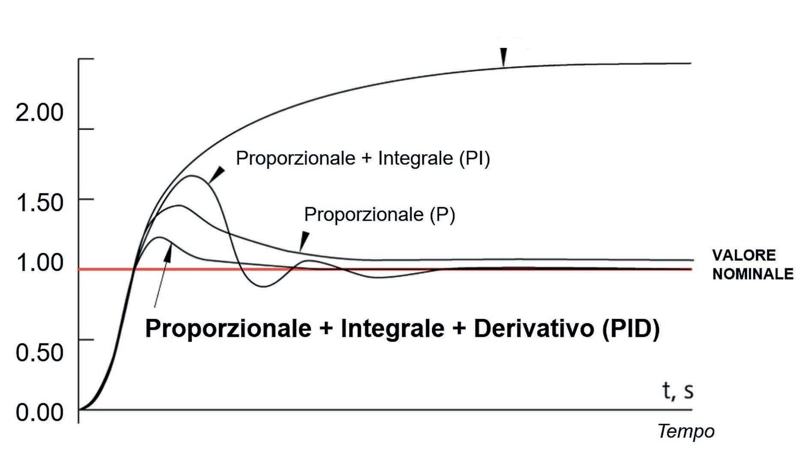

# Calibrazione Step/mm (Rotation Distance)

## Descrizione

Calibrazione della precisione di movimento degli assi X, Y, Z ed estrusore. In Klipper questo parametro si chiama `rotation_distance` e rappresenta la distanza percorsa per ogni rotazione completa del motore.

**Perché calibrare:**
- Dimensioni pezzi accurate
- Estrusione corretta (no over/under-extrusion)
- Qualità superfici migliorata

## Immagini

<div class="thumbnail-gallery">
  
</div>

## Rotation Distance vs Steps/mm

### Differenza tra Firmware

```yaml
Marlin (steps/mm):
  - Parametro: steps_per_mm
  - Calcolo: steps/mm = (motor_steps × microsteps) / rotation_distance
  - Esempio: (200 steps × 16 micro) / 80mm = 40 steps/mm

Klipper (rotation_distance):
  - Parametro: rotation_distance
  - Più intuitivo: distanza fisica per rotazione
  - GT2 20T: 20 teeth × 2mm = 40mm (poi verificare empiricamente)

Conversione:
  rotation_distance = (full_steps_per_rotation × microsteps) / steps_per_mm
```

## Calibrazione Assi X e Y

### Metodo Misurazione

```yaml
Strumenti:
  - Calibro digitale (precisione 0.01mm)
  - Righello metallico (>300mm)
  - Nastro adesivo per marcatura

Distanza test: 100mm (sufficiente per precisione)

Procedura:
  1. Home assi
  2. Posizionare marcatore su carriage
  3. Comandare movimento +100mm
  4. Misurare distanza effettiva percorsa
  5. Calcolare nuovo rotation_distance
  6. Aggiornare config
  7. Ripetere fino a precisione <0.1mm
```

### Calibrazione Asse X

```yaml
# Via console Klipper

# 1. Home e posizionamento
G28 X
G90
G1 X100 F3000          # Vai a posizione riferimento

# 2. Marcare posizione carriage (con nastro o pennarello)

# 3. Movimento test
G91                     # Relative mode
G1 X100 F1000          # Muovi +100mm
G90

# 4. Misurare distanza fisica percorsa con calibro
# Esempio: misurato 98.5mm invece di 100mm

# 5. Calcolo nuovo rotation_distance
# Formula: rotation_distance_nuovo = rotation_distance_attuale × (comandato / misurato)

rotation_distance_attuale = 80  # Da printer.cfg
comandato = 100
misurato = 98.5

rotation_distance_nuovo = 80 × (100 / 98.5) = 81.22

# 6. Aggiornare printer.cfg
[stepper_x]
rotation_distance: 81.22  # Invece di 80

# 7. FIRMWARE_RESTART

# 8. Ripetere test per verifica
```

### Calibrazione Asse Y

```yaml
# Stesso procedimento dell'asse X

G28 Y
G90
G1 Y100 F3000

# Marcare posizione

G91
G1 Y100 F1000
G90

# Misurare e calcolare

# Esempio Y:
rotation_distance_attuale = 40  # Doppia cinghia 2:1
comandato = 100
misurato = 99.2

rotation_distance_nuovo = 40 × (100 / 99.2) = 40.32

[stepper_y]
rotation_distance: 40.32
```

## Calibrazione Asse Z

### Metodo Comparatore

```yaml
Strumento: Comparatore digitale (opzionale) o calibro

Procedura:
  1. Home Z
  2. Posizionare comparatore sotto nozzle
  3. G91
  4. G1 Z10 F300          # Comando +10mm
  5. Misurare spostamento effettivo
  6. Calcolare rotation_distance

Attenzione:
  - Asse Z usa viti a ricircolo SFU1605
  - rotation_distance teorico = 5mm (passo vite)
  - Errore tipico < 0.5% (viti precisione C7)

# Esempio:
comandato = 10
misurato = 10.02  # Precisione viti alta

rotation_distance_nuovo = 5 × (10 / 10.02) = 4.99

# Spesso non necessaria calibrazione (viti già precise)
```

### Metodo Print Test

```yaml
# Alternativa: stampare cube e misurare altezza

Procedura:
  1. Stampare calibration cube 20×20×20mm
  2. Misurare altezza Z con calibro
  3. Se altezza ≠ 20mm: calibrare

Esempio:
  Altezza attesa: 20.00mm
  Altezza misurata: 19.85mm

rotation_distance_nuovo = 5 × (20 / 19.85) = 5.04
```

## Calibrazione Estrusore (E-steps)

### Metodo Cold Pull

```yaml
# Metodo più accurato (senza fusione filamento)

Preparazione:
  - Filamento caricato fino a hotend
  - Hotend FREDDO (<50°C)
  - Scollegare bowden o accesso filamento

Procedura:
  1. Marcare filamento a 120mm da estrusore
     (usare righello + pennarello)

  2. Via console:
     M302 P1               # Abilita cold extrude (Klipper: skip)
     G92 E0                # Reset posizione estrusore
     G1 E100 F60           # Estrudi 100mm LENTAMENTE (60mm/min)

  3. Misurare distanza rimasta:
     Esempio: da marcatura ora 22mm (invece di 20mm)
     Estruso reale = 120 - 22 = 98mm
     Comandato = 100mm

  4. Calcolo rotation_distance:
     rotation_distance_attuale = 7.82  # BMG tipico
     rotation_distance_nuovo = 7.82 × (100 / 98) = 7.98

  5. Aggiornare config:
     [extruder]
     rotation_distance: 7.98

  6. FIRMWARE_RESTART

  7. Ripetere test per verifica (deve estrudere esattamente 100mm)
```

### Metodo Hot Extrude

```yaml
# Alternativa con filamento fuso (meno preciso)

Preparazione:
  - Hotend riscaldato (200°C per PLA)
  - Filamento caricato

Procedura:
  M109 S200             # Attendi 200°C
  G92 E0
  G1 E100 F300          # Estrudi 100mm a 5mm/s

  # Misurare lunghezza filamento estruso
  # (Difficile: filamento fuso, soggetto a dilatazione)

  # Metodo alternativo: pesare
  1. Tagliare 200mm filamento
  2. Pesare (es: 0.52g)
  3. Estrudere G1 E100 F300
  4. Pesare residuo (es: 0.26g)
  5. Estruso = 0.52 - 0.26 = 0.26g = ~100mm

  # Meno preciso, preferire cold pull
```

## Verifica Finale con Calibration Cube

### Stampare Test Cube

```yaml
File: calibration_cube_20mm.stl
  - Dimensioni: 20 × 20 × 20 mm
  - Semplice da misurare
  - Verifica tutti gli assi

Download: https://www.thingiverse.com/thing:1278865

Slicer settings:
  - Layer height: 0.2mm
  - Infill: 20%
  - No supports
  - Velocità: 50mm/s

Stampa: ~15-20 minuti
```

### Misurazioni Post-Stampa

```yaml
Misurare con calibro digitale:

Asse X (larghezza):
  - Target: 20.00mm
  - Tolleranza: ±0.2mm
  - Se fuori tolleranza: ricalibrare X

Asse Y (profondità):
  - Target: 20.00mm
  - Tolleranza: ±0.2mm

Asse Z (altezza):
  - Target: 20.00mm
  - Tolleranza: ±0.1mm (più critico)

Se dimensioni corrette: ✓ Calibrazione OK
Se errori sistematici: ricalcolare rotation_distance
```

## Calcolo Automatico Rotation Distance

### Script Python Helper

```python
#!/usr/bin/env python3
"""
Calcolo rotation_distance per Klipper
"""

def calc_rotation_distance(current_rd, commanded, measured):
    """
    Calcola nuovo rotation_distance

    Args:
        current_rd: rotation_distance attuale in config
        commanded: distanza comandata (es. 100mm)
        measured: distanza misurata effettiva (es. 98.5mm)

    Returns:
        nuovo rotation_distance
    """
    new_rd = current_rd * (commanded / measured)
    return round(new_rd, 2)

def calc_from_steps_per_mm(steps_per_mm, full_steps=200, microsteps=16):
    """
    Converte steps/mm (Marlin) in rotation_distance (Klipper)

    Args:
        steps_per_mm: valore Marlin
        full_steps: step motore (default 200 = 1.8°)
        microsteps: microstep configurato

    Returns:
        rotation_distance
    """
    rotation_distance = (full_steps * microsteps) / steps_per_mm
    return round(rotation_distance, 2)

# Esempi
print("=== Calibrazione Rotation Distance ===")
print()

# Esempio asse X
current = 80.0
commanded = 100.0
measured = 98.5
new_rd = calc_rotation_distance(current, commanded, measured)
print(f"Asse X: {current} → {new_rd} mm")

# Esempio estrusore
current_e = 7.82
commanded_e = 100.0
measured_e = 98.0
new_rd_e = calc_rotation_distance(current_e, commanded_e, measured_e)
print(f"Estrusore: {current_e} → {new_rd_e} mm")

# Conversione da Marlin
print()
print("=== Conversione da Marlin ===")
steps_mm = 80  # steps/mm da Marlin
rd = calc_from_steps_per_mm(steps_mm)
print(f"{steps_mm} steps/mm = {rd} mm rotation_distance")
```

## Valori Rotation Distance Comuni

```yaml
# Riferimento (verificare sempre empiricamente)

Cinghie GT2:
  - Puleggia 16T: 32mm
  - Puleggia 20T: 40mm
  - Puleggia 20T (ma config 80mm): doppio rapporto o errore

Viti metriche:
  - TR8×2: 2mm
  - TR8×4: 4mm
  - TR8×8: 8mm

Estrusori:
  - BMG clone: 7.5-8.5mm (variabile, CALIBRARE!)
  - Titan: 7.8-8.2mm
  - Direct drive generico: 22-25mm
```

## Troubleshooting

### Dimensioni Pezzo Sbagliate

```yaml
Sintomo: Calibration cube 20mm misura 19.5mm

Debug:
  1. Verificare rotation_distance calibrato
  2. Check scaling in slicer (deve essere 100%)
  3. Verificare flow rate (deve essere 100%)
  4. Escludere problemi meccanici:
     - Cinghie tese correttamente
     - Pulegge fissate su albero motore (grani serrati)
     - Nessun gioco meccanico
```

### Estrusione Inconsistente

```yaml
Sintomo: Rotation_distance sembra cambiare

Cause:
  1. Ingranaggi BMG sporchi o usurati
  2. Tensione estrusore non costante
  3. Filamento diametro variabile
  4. Temperatura hotend oscillante

Soluzioni:
  - Pulire ingranaggi estrusore
  - Verificare tensione molla corretta
  - Usare filamento qualità (±0.02mm)
  - PID tuning hotend
```

## Checklist

- [ ] Rotation distance asse X calibrato (errore <0.1mm su 100mm)
- [ ] Rotation distance asse Y calibrato
- [ ] Rotation distance asse Z verificato (viti precise)
- [ ] Rotation distance estrusore calibrato (cold pull)
- [ ] Calibration cube stampato
- [ ] Dimensioni cube: X±0.2mm, Y±0.2mm, Z±0.1mm
- [ ] Valori salvati in printer.cfg
- [ ] Backup configurazione
- [ ] Test ripetuto per conferma

---

[← Torna alle Fasi di Realizzazione](../README.md) | [Torna al Progetto](../../index.md)
