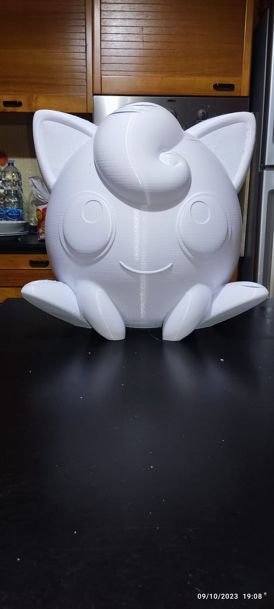

# Stampante 3D di Grandi Dimensioni - Custom Build


## Panoramica Progetto

Una stampante 3D custom di **grandi dimensioni** progettata e realizzata da zero per superare i limiti delle stampanti consumer. Questo progetto rappresenta la convergenza di competenze in elettronica, meccanica, software e automazione.

**Volume di stampa:** 900 x 740 x 800 mm
**Firmware:** Klipper
**Controller:** BIGTREETECH Octopus Pro V1.1 (STM32H723)
**Interfaccia:** Mainsail Web UI

---

## Perché questo progetto?

Le stampanti 3D commerciali di grandi dimensioni hanno costi proibitivi (5.000-15.000€). Costruirne una custom permette di:
- ✅ Ridurre drasticamente i costi (circa 1/3 del prezzo commerciale)
- ✅ Personalizzare ogni aspetto secondo le proprie esigenze
- ✅ Ottenere prestazioni superiori con componenti selezionati
- ✅ Avere pieno controllo su manutenzione e upgrade

---

## Caratteristiche Tecniche

### Specifiche Meccaniche
*Alcuni parametri sono conservativi al fine di ottenere una qualità di stampa migliore a discapito di velocità maggiori.*


- **Cinematica:** Cartesiana, a piano mobile verticale (Z-axis bed): La testina gestisce i movimenti XY, mentre il piano di stampa si muove solo verticalmente (asse Z)
- **Area di stampa:** 900mm (X) × 740mm (Y) × 800mm (Z)
- **Trasmissione X:** Cinghia GT2 (6mm) rotation distance 80mm
- **Trasmissione Y:** Cinghie GT2 (10mm) con rapporto 2:1, rotation distance 40mm
- **Trasmissione Z:** Viti a ricircolo SFU1605, rotation distance 5mm
- **Velocità massima:** 500 mm/s
- **Accelerazione:** 1000 mm/s²

### Elettronica
- **Scheda madre:** BIGTREETECH Octopus Pro V1.1
- **MCU:** STM32H723XX
- **Driver stepper:** TMC 2209 v.3 (modalità DIR/STEP) per (asse X e per estrusore)
- **Driver stepper:** DM556 20-50V 5,6A per (assi Y e Z)
- **Microstep:** X: 1/16, Y: 1/64, Z: 1/32, Estrusore: 1/8
- **Host:** Raspberry Pi (Klipper + Mainsail)

### Estrusore e Hotend
- **Ugello:** 0.4mm
- **Filamento:** 1.75mm
- **Temperatura max:** 300°C
- **Sensore:** ATC Semitec 104GT-2
- **Pressure advance:** Configurato per stampe di precisione

### Sistema di Livellamento
- **Sensore:** BLTouch (Z virtual endstop)
- **Auto bed leveling:** Mesh bed leveling
- **Compensazione:** Automatica con mesh salvata

### Monitoraggio Avanzato
- **Sensori temperatura:** Hotend, piatto riscaldato, Raspberry Pi, MCU
- **Accelerometro/Giroscopio:** Per Input Shaper e risonanza (opzionale)
- **Rilevamento filamento:** Runout sensor
- **Monitoraggio web:** Dashboard in tempo reale con grafici

### Features Software
- **Firmware:** Klipper (alta performance, configurazione flessibile)
- **Interfaccia web:** Mainsail (controllo completo da browser)
- **Timelapse:** Registrazione automatica stampe
- **Input Shaper:** Compensazione risonanze per velocità elevate
- **Macro personalizzate:** Automazione completa workflow

---

## Componenti Principali

### Meccanica
- Profili in acciaio 40x20x2 per struttura portante
- Guide lineari e carrelli per tutti gli assi
- Cinghie GT2 di alta qualità
- Viti a ricircolo TR8x5 per asse Z
- Supporti stampati 3D custom (vedi cartella `/cad`)

### Elettronica
- BIGTREETECH Octopus Pro V1.1
- Raspberry Pi 3/4 per Klipper
- Motori stepper NEMA 17/23
- Alimentatore 24V 10A per Octopus Pro V1.1 e per nema 17
- Alimentatore 24V 62.5A ad alta potenza per piatto (9 piastre da 200W)
- Alimentatore 36V 30A per nema 23
- Piatto riscaldato custom con controllo temperatura avanzato
- Sensori di qualità e endstop meccanici

### Sicurezza
- Thermal runaway protection
- Sistema di raffreddamento alimentazione piatto
- Monitoraggio temperature multiple
- Power panic

---

## Skills Richieste

| Skill | Livello | Note |
|-------|---------|------|
| Elettronica digitale | ⭐⭐⭐⭐ | Cablaggio, pinout, debugging |
| Microcontrollori | ⭐⭐⭐ | Configurazione firmware |
| CAD/Disegno tecnico | ⭐⭐⭐ | Progettazione parti custom |
| Meccanica | ⭐⭐⭐⭐ | Assemblaggio precisione |
| Linux/Networking | ⭐⭐ | Setup Raspberry Pi |
| Problem solving | ⭐⭐⭐⭐⭐ | Tuning e calibrazione |

---

## Fasi di Realizzazione

### 1. Progettazione (2 settimane)
- [Studio e dimensionamento struttura](fasi-realizzazione/1-progettazione/studio-dimensionamento-struttura.md)
- [Selezione componenti](fasi-realizzazione/1-progettazione/selezione-componenti.md)
- [Disegno CAD parti custom](fasi-realizzazione/1-progettazione/disegno-cad-parti-custom.md)
- [Schema elettrico e pinout](fasi-realizzazione/1-progettazione/schema-elettrico-pinout.md)

### 2. Costruzione Meccanica (1 settimana)
- [Taglio e assemblaggio telaio](fasi-realizzazione/2-costruzione-meccanica/taglio-assemblaggio-telaio.md)
- [Montaggio guide lineari](fasi-realizzazione/2-costruzione-meccanica/montaggio-guide-lineari.md)
- [Installazione trasmissioni](fasi-realizzazione/2-costruzione-meccanica/installazione-trasmissioni.md)
- [Montaggio estrusore e hotend](fasi-realizzazione/2-costruzione-meccanica/montaggio-estrusore-hotend.md)

### 3. Cablaggio Elettronico (3 giorni)
- [Installazione scheda madre](fasi-realizzazione/3-cablaggio-elettronico/installazione-scheda-madre.md)
- [Cablaggio motori e sensori](fasi-realizzazione/3-cablaggio-elettronico/cablaggio-motori-sensori.md)
- [Alimentazione e sicurezze](fasi-realizzazione/3-cablaggio-elettronico/alimentazione-sicurezze.md)
- [Test continuità](fasi-realizzazione/3-cablaggio-elettronico/test-continuita.md)

### 4. Setup Software (2 giorni)
- [Installazione Klipper su Raspberry Pi](fasi-realizzazione/4-setup-software/installazione-klipper-raspberry-pi.md)
- [Configurazione printer.cfg](fasi-realizzazione/4-setup-software/configurazione-printer-cfg.md)
- [Setup Mainsail UI](fasi-realizzazione/4-setup-software/setup-mainsail-ui.md)
- [Test comunicazione MCU](fasi-realizzazione/4-setup-software/test-comunicazione-mcu.md)

### 5. Calibrazione e Tuning (1 settimana)
- [PID tuning hotend e piatto](fasi-realizzazione/5-calibrazione-tuning/pid-tuning-hotend-piatto.md)
- [Calibrazione step/mm](fasi-realizzazione/5-calibrazione-tuning/calibrazione-step-mm.md)
- [Input shaper (risonanze)](fasi-realizzazione/5-calibrazione-tuning/input-shaper-risonanze.md)
- [Mesh bed leveling](fasi-realizzazione/5-calibrazione-tuning/mesh-bed-leveling.md)
- [Pressure advance](fasi-realizzazione/5-calibrazione-tuning/pressure-advance.md)
- [Retraction tuning](fasi-realizzazione/5-calibrazione-tuning/retraction-tuning.md)

### 6. Test e Ottimizzazione (continuo)
- [Stampe di test](fasi-realizzazione/6-test-ottimizzazione/stampe-test.md)
- [Fine tuning parametri](fasi-realizzazione/6-test-ottimizzazione/fine-tuning-parametri.md)
- [Upgrade incrementali](fasi-realizzazione/6-test-ottimizzazione/upgrade-incrementali.md)

---

## Costi Stimati

| Categoria | Costo Approssimativo |
|-----------|---------------------|
| Profili acciaio 40x20x2mm | 100-150€ |
| Guide MGN20H 4 guide 1000mm + 4 carrelli modello lungo | 280-320€ |
| Guide MGN12 2 guide 1000mm + 2 carrelli modello lungo | 70-90€ |
| Elettronica (Octopus Pro + RPi) | 150-250€ |
| Motori stepper - 6 Nema 23 - 3.0Nm - 4.2A | 240-360€ |
| Motori stepper - 2 Nema 17 - 59Ncm - 2.0A | 30-60€ |
| Driver per motori stepper | 200-250€ |
| Hotend e estrusore | 80-100€ |
| Riscaldatori per piatto custom - N.9 | 200-250€ |
| Vetro temperato per alte temerature per piatto 900x900x10mm | 180-230€ |
| Sensori e accessori | 50-100€ |
| Alimentatori | 150-200€ |
| **TOTALE** | **~1.700-2.300€** |

*Vs. stampante commerciale equivalente: 5.000-15.000€*

---

## Contenuti Repository

```
Stampante 3D/
├── cad/                    # File CAD parti custom (DWG)
│   ├── supporti motori
│   ├── staffe componenti
│   └── box elettronica
├── media/                  # Foto e video del progetto
│   ├── costruzione
│   ├── elettronica
│   └── stampe test
├── software/              # Configurazioni firmware
│   └── printer.cfg        # Config Klipper completa
└── README.md              # Questo file
```

---

## Gallery


### Stampante - Viste Generali

<div class="gallery-grid">
<a onclick="openLightbox('media/stampante%20attuale%201.jpeg')"></a>
<a onclick="openLightbox('media/stampante%20attuale%202.jpeg')"></a>
<a onclick="openLightbox('media/stampante%201.jpeg')"></a>
<a onclick="openLightbox('media/stampante%202.jpeg')"></a>
<a onclick="openLightbox('media/stampante%203.jpeg')"></a>
</div>

### Stampe Realizzate

<div class="gallery-grid">
<a onclick="openLightbox('media/stampante%20poke%201.jpeg')"></a>
<a onclick="openLightbox('media/stampante%20poke%202.jpeg')"></a>
<a onclick="openLightbox('media/poke.jpeg')"></a>
<a onclick="openLightbox('media/stampante%20espeon.jpeg')"></a>
<a onclick="openLightbox('media/stampante%20eolo%201.jpeg')"></a>
<a onclick="openLightbox('media/stampante%20eolo%202.jpeg')"></a>
</div>

### Elettronica e Componenti

<div class="gallery-grid">
<a onclick="openLightbox('media/stampante%20elettronica%20piatto.jpeg')"></a>
<a onclick="openLightbox('media/stampante%20elettronica%20piatto%202.jpeg')"></a>
<a onclick="openLightbox('media/BIGTREETECH%20Octopus%20Pro%20V1.1-Pin.jpg')"></a>
<a onclick="openLightbox('media/Interfaccia%20web%20piatto.JPG')"></a>
</div>

### Sistema di Raffreddamento

<div class="gallery-grid">
<a onclick="openLightbox('media/sistema%20raffreddamento%20alimentatore%20piatti.jpeg')"></a>
</div>

### Sensori e Calibrazione

<div class="gallery-grid">
<a onclick="openLightbox('media/stampante%20giroscopio-accelerometro.jpg')"></a>
<a onclick="openLightbox('media/stampante%20test%20piatto%201.jpeg')"></a>
<a onclick="openLightbox('media/stampante%20pendolo%202.jpeg')"></a>
<a onclick="openLightbox('media/test%20all%20in%20one%20stampante%201.jpg')"></a>
</div>

### Video

#### Serie Matrioska - Stampante che stampa su stampante

<div class="video-container" onclick="openVideoModal('media/stampante%20video%20matriosca%201.mp4', 'media/posters/poster-matriosca-1.jpg', 'Serie Matrioska - Parte 1')">
<video poster="media/posters/poster-matriosca-1.jpg">
  <source src="media/stampante%20video%20matriosca%201.mp4" type="video/mp4">
</video>
<p>Parte 1</p>
</div>
<div class="video-container" onclick="openVideoModal('media/stampante%20video%20matriosca%202.mp4', 'media/posters/poster-matriosca-2.jpg', 'Serie Matrioska - Parte 2')">
<video poster="media/posters/poster-matriosca-2.jpg">
  <source src="media/stampante%20video%20matriosca%202.mp4" type="video/mp4">
</video>
<p>Parte 2</p>
</div>
<div class="video-container" onclick="openVideoModal('media/stampante%20video%20matriosca%203.mp4', 'media/posters/poster-matriosca-3.jpg', 'Serie Matrioska - Parte 3')">
<video poster="media/posters/poster-matriosca-3.jpg">
  <source src="media/stampante%20video%20matriosca%203.mp4" type="video/mp4">
</video>
<p>Parte 3</p>
</div>
<div class="video-container" onclick="openVideoModal('media/stampante%20video%20matriosca%204.mp4', 'media/posters/poster-matriosca-4.jpg', 'Serie Matrioska - Parte 4')">
<video poster="media/posters/poster-matriosca-4.jpg">
  <source src="media/stampante%20video%20matriosca%204.mp4" type="video/mp4">
</video>
<p>Parte 4</p>
</div>
<div class="video-container" onclick="openVideoModal('media/stampante%20video%20matriosca%205.mp4', 'media/posters/poster-matriosca-5.jpg', 'Serie Matrioska - Parte 5')">
<video poster="media/posters/poster-matriosca-5.jpg">
  <source src="media/stampante%20video%20matriosca%205.mp4" type="video/mp4">
</video>
<p>Parte 5</p>
</div>
<div class="video-container" onclick="openVideoModal('media/stampante%20video%20matriosca%206.mp4', 'media/posters/poster-matriosca-6.jpg', 'Serie Matrioska - Parte 6')">
<video poster="media/posters/poster-matriosca-6.jpg">
  <source src="media/stampante%20video%20matriosca%206.mp4" type="video/mp4">
</video>
<p>Parte 6</p>
</div>
<div class="video-container" onclick="openVideoModal('media/stampante%20video%20matriosca%207.mp4', 'media/posters/poster-matriosca-7.jpg', 'Serie Matrioska - Parte 7')">
<video poster="media/posters/poster-matriosca-7.jpg">
  <source src="media/stampante%20video%20matriosca%207.mp4" type="video/mp4">
</video>
<p>Parte 7</p>
</div>

#### Test e Calibrazione

<div class="video-container" onclick="openVideoModal('media/stampante%20controllo%20temperature%20piatto.mp4', 'media/posters/poster-controllo-temperature.jpg', 'Controllo Temperature Piatto')">
<video poster="media/posters/poster-controllo-temperature.jpg">
  <source src="media/stampante%20controllo%20temperature%20piatto.mp4" type="video/mp4">
</video>
<p>Controllo Temperature Piatto</p>
</div>
<div class="video-container" onclick="openVideoModal('media/stampante%20pendolo.mp4', 'media/posters/poster-pendolo.jpg', 'Test Adesione Pendolo')">
<video poster="media/posters/poster-pendolo.jpg">
  <source src="media/stampante%20pendolo.mp4" type="video/mp4">
</video>
<p>Test Adesione Pendolo</p>
</div>
<div class="video-container" onclick="openVideoModal('media/stampante%20pendolo%201.mp4', 'media/posters/poster-pendolo-1.jpg', 'Test Pendolo (alternativo)')">
<video poster="media/posters/poster-pendolo-1.jpg">
  <source src="media/stampante%20pendolo%201.mp4" type="video/mp4">
</video>
<p>Test Pendolo (alternativo)</p>
</div>
<div class="video-container" onclick="openVideoModal('media/stampante%20video%20xx.mp4', 'media/posters/poster-video-xx.jpg', 'Video Stampa')">
<video poster="media/posters/poster-video-xx.jpg">
  <source src="media/stampante%20video%20xx.mp4" type="video/mp4">
</video>
<p>Video Stampa</p>
</div>

---

## Difficoltà e Sfide Affrontate

### Sfide Meccaniche
- **Rigidità struttura:** Con dimensioni così grandi, vibrazioni e flessioni sono critiche
- **Allineamento assi:** Precisione micrometrica su quasi 1 metro di corsa
- **Peso piatto:** Sistema di gestione movimento asse z con 4 stepper nema 23 e guide a ricircolo di sfere
- **Dimensioni piatto:** Sistema di riscaldamento custom per grandi superfici con 9 riscaldatori da 200W ciascuno e vetro temperato per alte temperature 900x900x10mm (20Kg)

### Sfide Elettroniche
- **Gestione potenza:** Piatto grande richiede correnti elevate
- **Cablaggio ordinato:** Un centinaio di connessioni da gestire
- **Raffreddamento:** Dissipazione termica di elettronica e alimentazione

### Sfide Software
- **Tuning Klipper:** Configurazione ottimale per macchina custom
- **Input Shaper:** Eliminare risonanze su struttura grande
- **Mesh leveling:** Compensare eventuali imperfezioni del piatto

---

## Risultati

✅ **Stampante funzionante e affidabile**
✅ **Qualità stampa paragonabile a stampanti commerciali**
✅ **Costo totale 1/5 rispetto a soluzioni commercial**
✅ **Piena customizzabilità e upgradeabilità**
✅ **Conoscenza approfondita di ogni componente**

---

## Progetti Correlati

- 🔧 [CNC 5 Assi](../CNC/) - Fresa CNC custom
- 📐 [Plotter Verticale](../Plotter%20verticale/) - Wall plotter automatico
- 📡 [Radar](../Radar/) - Sistema radar con interfaccia web

---

## Contatti e Collaborazioni

Questo progetto è parte del lavoro svolto insieme all'Ing. Cosimo Borrello, mio carissimo amico con cui condivido di persona la passione per l'automazione e elettronica. 

Se sei interessato a:
- Consulenze per costruzione stampanti custom
- Ottimizzazione e tuning stampanti esistenti
- Progetti di automazione e controllo
- Sviluppo firmware embedded

📧 Contattami per collaborazioni!

---

## Licenza e Utilizzo

I file CAD e le configurazioni sono fornite "as-is" a scopo educativo. Sentiti libero di trarre ispirazione per i tuoi progetti!

**Note:** Questo progetto richiede conoscenze avanzate di elettronica e meccanica. Procedere con cautela e rispettare sempre le norme di sicurezza.

---

[Torna al Portfolio](../README.md)

---

*Ultima modifica: Gennaio 2026*
